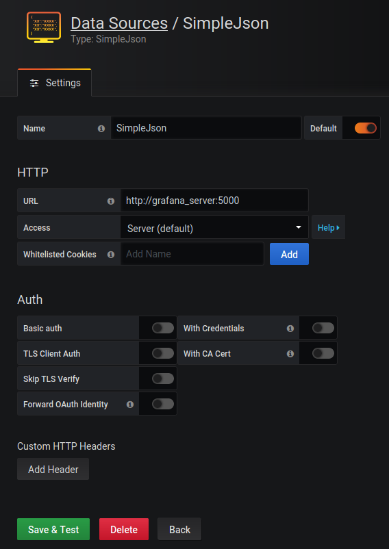
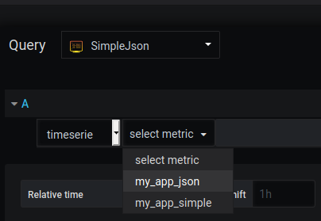
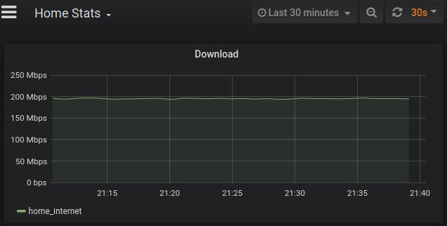

<h1>DMS</h1>

Simple datastore for arbitrary data, fronted by grafana.
While Grafana fetches the data normally, this makes it easy for
applications to push their own data. Allows setting a custom 'received time'
to either push old data or later push data when internet might be available.

Both simple values and complex JSON data is accepted,
if the <APP_NAME> doesn't exist already, it is created.
```
curl -X POST -H "Content-Type: text/plain" --data "<DATA>" <URL>/app/<APP_NAME>
```
Note: Optionally `?created=<UNIX_TIME>` can store the entry as received
at certain time.
<h2>Running locally</h2>

```
./rb.sh (runs setup as docker-compose)
./seed_dms.sh (for some initial test data)
```
Navigate to http://0.0.0.0:3000, follow Grafana setup.
Use the SimpleJson datasource as follows:



<h2>Usage</h2>
When adding dashboards, the apps that has been created through pushed
data is available as metric options:



Because complex data isn't available as timeseries normally, a property
can be chosen to represent the table-data when shown as timeseries:
```
curl -X POST -H "Content-Type: text/plain" --data '{"data_series_var": "<PROPERTY_PATH>"}' <URL>/app/<APP_NAME>/config
```
The `data_series_var` property describes the path to the desired property:
```
{
    "my": {
        "nested": {
            "property": 42
        }
    }
}
```
```
{"data_series_var": "my.nested.property"}
```
allowing fancy timeseries-graphs from pushed JSON


From here, data that is pushed under new app-names automatically
appear as metrics.

<h2>Development</h2>
_Remember to set a data-folder for the postgres volume to mount!_
Run tests (requires python dependencies available):

```
./test.sh $(<project_root_path>)
```
